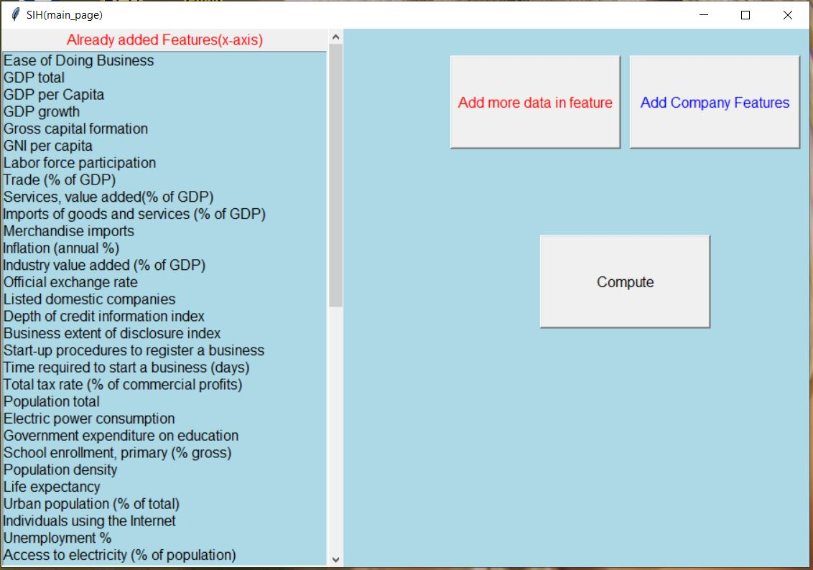
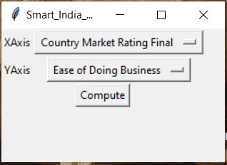
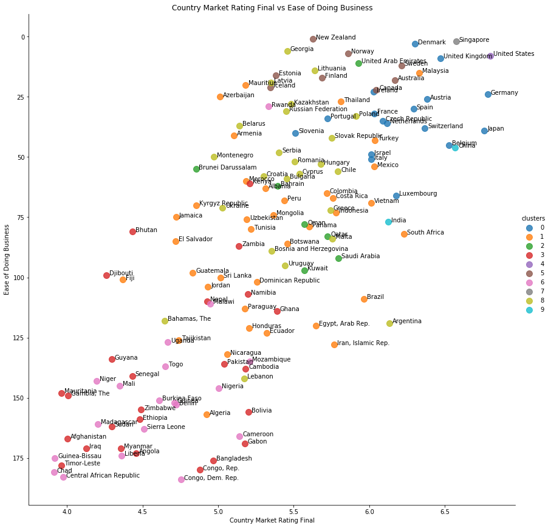

# Rating & Clustering of Country on the basis of Ease of doing Business for Specific and General market for Financial Descision Making

#### _By **Yashashwi Sidharth**_

## Introduction

Expanding Business globally is a challenge for organizations. Companies' Resources are limited so companies have to pick and choose countries to expand into. This process of selecting countries is a difficult one and is getting even more difficult due economic growth of various small countries which are becoming a great potential market. 

## Solution

* The ease of doing business depends on various factors ranging from economic, social and even geographical. By quantifying and combining these factors mathematically we can determine an index that will indicate the ease of doing business in a country for a specific or general market. We will call this index Country Market Rating.

* We can use country market rating to rank the countries in order of ease of doing business.

* The various factors used can also help in clustering the countries. Clustering will group the countries with similar market conditions. 

* Ranking along with clustering can help organizations to decide which country to expand into next.

## Features or Factors 

* We have extracted 60 features from authorized sources like World Bank, UNDP and Yahoo Finance

* Features can be categorized into Economic, Social, Geographic, Logistics Performance, Research, Domain Specific and Stock Features 

* We took the data across a span of 14 years for all the countries and used regression over it to determine the direction in which market is heading for all those countries individually. We used trend as a feature for current cycle. Static data is like a snapshot in time which is not very reliable for taking long term decisions, thus making trend a crucial feature. 

## Some Main Features

* **Economic Features:**
1. GDP
2. GDP Growth
3. Trade (% of GDP)
4. Time Required to Start a Business
5. Total tax rate (% of commercial profit)

* **Social Features:**
1. Population
2. Electric Power Consumption
3. Government expenditure on education (% of GDP)
4. HDI

* **Research & Development:**
1. Patient Application (Residents)
2. Patient Applications (Non Residents)
3. Research and Development Expenditure (% of GDP)
4. Researchers in R&D (per million people)

* **Logistic Performance Features (On Scale of 1-5):**
6. Efficiency of Customs Clearance Process
7. Ability to track and trace consignments
8. Transportation

* **Geographical Features:**
1. Average Precipitation (mm per Year)

* **Domain specific feature are also added. So that result can be targeted to certain kind of market. In this project pharma market is being target. So relevent features are added e.g. disease related data etc.**

# Country Market Rating (index)

Country market rating will indicate the ease of doing business in various country or for market penetration.

**Scaling:**

The first step in calculating CMR index is scaling. The various features used for training the model were measured on different scales, for example Population is measured in billions while logistics quality had a range from (1-5). To bring all the features to a notionally common scale, we have done normalization and have brought all the values in the range of (0-1). The two techniques used for the same are:

**1) Logarithmic Scaling** (for data with large ranges):

**1) Min-Max Scaling** (for data with small ranges):

_(*) These methods of Scaling are inspired by UNDP’s method for calculating HDI_

# Country Market Rating Final (Including Trend)

* Group By regression was done on each country for its country market rating throughout the years. Slope of the best fit curve was taken as a feature (trend) and min-max scaling was done on it.  

* Countries were ranked according to CMRF Index

# Country Clustering

K-Means Clustering was used to cluster the countries with similar market conditions. Clustering will help organization by telling them the familiarity of entering  a country. If an organization is already doing business in a country within certain cluster then entering into other countries within same cluster will be easier for them because of same policies, challenges etc. 
We divided the countries into 10 clusters.

# Using the Application

After running the code from the given file data will be extracted from UNDP and World Bank which may take some time depending on the system and internet speed.
(10 min - 15 min is average waiting time)
**(If the application crashes after running for the first time then try running it again from line 184. This time it will not take much time and will be instantaneous.)**

* After some time following window will appear:

* In the above window you can choose to add new features. If you do so then following window will appear:

You may type the feature you want to add and the application will search search that feature in world bank database. Search result will appear and you can choose to add the feature.

* You can add feature and then press compute or press compute right away. The following window will appear. You can select both axis from the window for graphical representation. Default options are suggested for best insight.

* **Following plot will be opened along with the rank of countries.**

# Interpreting the plot

Y axis represents Ease of Boing Business(From World Bank) and X axis represents Country Market Rating Final (Calculated by Our Application).
So the countries which are higher are better for business in general. And the countries which are right most are best for business in the domain of target (Pharma in this case). Each country is coloured according to the cluster in which they belong and those countries which are in the same cluster have similar business environment. So if a company is alread working in a country belonging in a cluter, it will be easir for that country to enter other countries in the same cluster.

## Support and contact details

_Please contact  Yashashwi Sidharth with questions and comments._

### License

*GNU GPLv3*

Copyright (c) 2019 **_Yashashwi Sidharth_**

